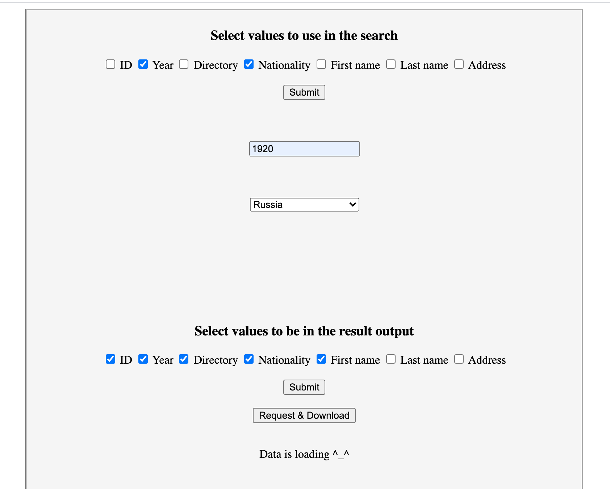
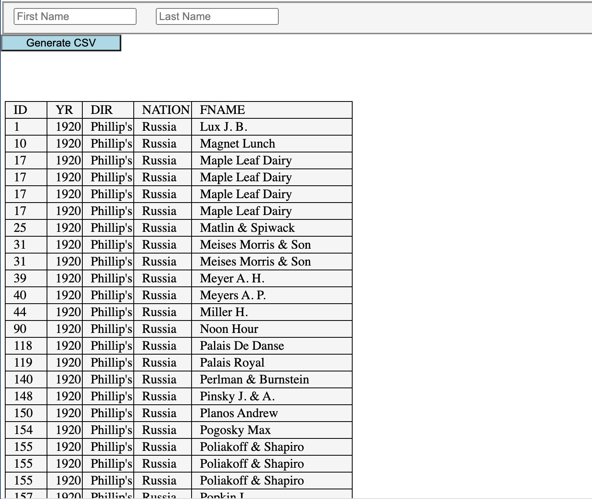

# search-page-demo
Interface for HRL search page.  
Note that this page is mainly used to demonstrate the API functionality.

1. Search page
Front-end allows to search by specific parameters in the Restaurant Owner Dataset (US Census) and retrieve requested data (with specific values) in a tabular format: 

2. Results page
Results are displayed in a dynamic table that is changed based on the number and content of the columns and rows: 

